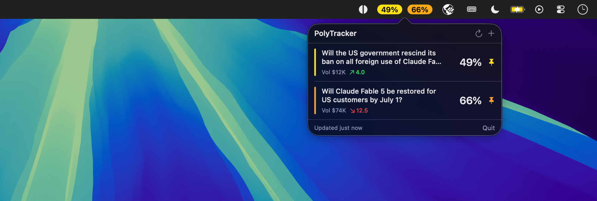

# PolyTracker

A minimalist macOS menu bar app that tracks [Polymarket](https://polymarket.com) markets.



- **Menu bar:** shows only the probability (%) of your pinned market.
- **Click:** opens a popover listing every tracked market. Tap one for volume, 24h
  change, liquidity, resolution date, and a price-history chart.
- **Manage:** search markets by keyword (or paste a Polymarket URL) to add/remove.

Data comes from Polymarket's public Gamma API (discovery/metadata) and CLOB API
(price history) — no API key or login required.

## Download

Grab `PolyTracker.zip` from the [latest release](https://github.com/phisn/polytracker/releases/latest),
unzip it, and drag `PolyTracker.app` into `/Applications`. Apple Silicon, macOS 14+.

The app is unsigned, so macOS Gatekeeper blocks it on first launch. Right-click the
app and choose **Open**, or clear the quarantine flag first:

```sh
xattr -dr com.apple.quarantine /Applications/PolyTracker.app
```

## Build & run

Requires macOS 14+ and a Swift 6 toolchain (ships with Xcode 16 / recent Command
Line Tools).

```sh
# Quick dev run (menu bar item appears immediately, no Dock icon):
make run

# Build a distributable .app bundle:
make app
open ./PolyTracker.app
```

## How it works

| Concern            | Source                                                            |
| ------------------ | ----------------------------------------------------------------- |
| Search / discovery | `GET https://gamma-api.polymarket.com/public-search?q=…`          |
| Market metadata    | `GET https://gamma-api.polymarket.com/markets/{id}`               |
| Price history      | `GET https://clob.polymarket.com/prices-history?market={tokenId}` |

Tracked markets persist in `UserDefaults`. Snapshots refresh every 30s.

## Menu bar position

macOS places third-party menu bar items in the right cluster (left of the system
clock/Control Center). There is no public API to pin an item beside the notch —
the reliable way to move it is ⌘-dragging it where you want; macOS remembers the spot.
